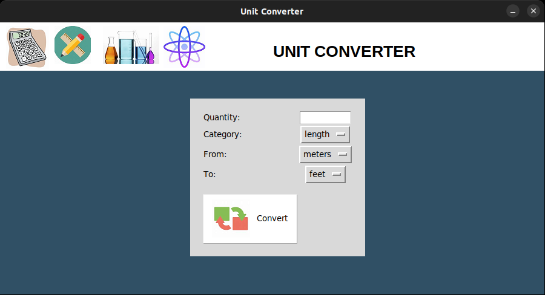
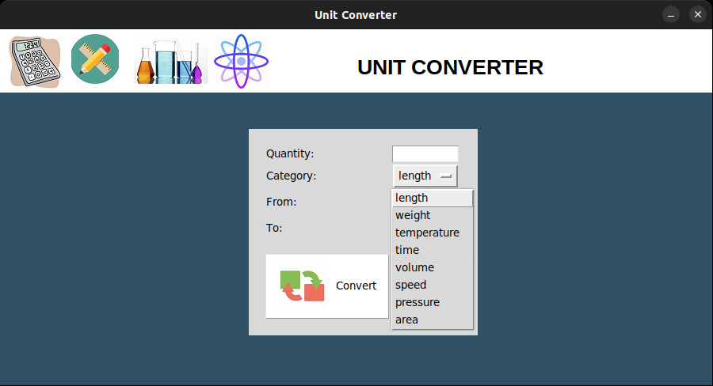
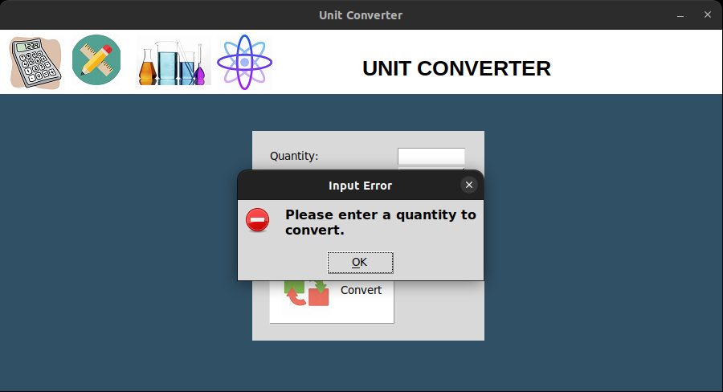
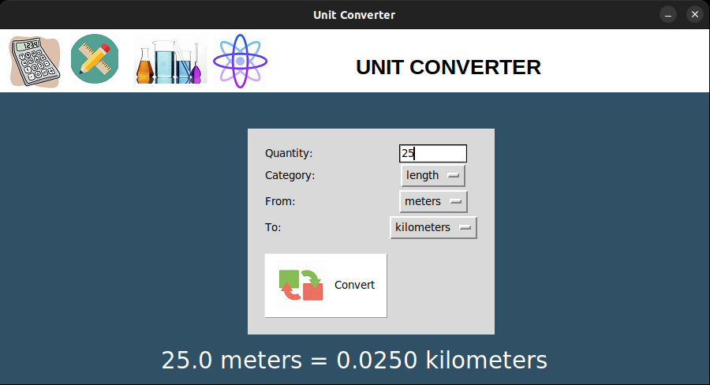

# 🧮 Unit Converter

A modern, advanced **Unit Converter GUI** application built with Python and `Tkinter`. This program allows users to seamlessly convert values between various units across **8 major categories** — with no internet connection required.

Whether you're a student, engineer, researcher, or simply curious — this standalone desktop tool is designed for precision, ease-of-use, and flexibility.

---

## ✨ Key Features

- 📐 **8 Conversion Categories**: Length, Weight, Temperature, Time, Volume, Speed, Pressure, and Area  
- ⚡ **Fast & Offline**: Fully functional without any internet connection  
- 🧠 **Smart Temperature Handling**: Built-in logic to handle Celsius, Fahrenheit, and Kelvin accurately  
- 🔍 **Live Output Formatting**: Results are automatically scaled and formatted clearly  
- ❌ **Robust Error Handling**: Friendly error messages for incorrect or missing inputs  
- 🖥️ **Responsive GUI**: Designed with intuitive layout and visual clarity  

---

## 🧠 How It Works

1. Launch the program using the command below.
2. Enter the **quantity** you want to convert.
3. Choose a **category** (e.g., Length, Weight, Temperature).
4. Select the **from unit** and the **to unit**.
5. Click **Convert** to see the result displayed clearly at the bottom.

Temperature conversions are handled through **custom mathematical formulas**, while all other categories use **standard scaling factors**.

---

## 🛠 Installation & Setup

### 1️⃣ Clone the Repository

```bash
git clone https://github.com/waziri245/Unit-Converter.git
cd Unit-Converter
```

### 2️⃣ Run the Application

```bash
python src/unit_converter.py
```

No additional libraries required — just standard Python and `tkinter`.

---

## 📂 Project Structure

```
Unit-Converter/
├── .github/
│   └── workflows/
│       └── python-test.yml
├── assets/
│   ├── icons/
│   │   ├── calculator.png
│   │   ├── area.png
│   │   ├── volume.png
│   │   ├── ruler.png
│   │   └── convert.png
│   └── screenshots/
│       ├── main_screen.png
│       ├── categories.png
│       ├── error_handling.png
│       └── example.png
├── src/
│   ├── __init__.py
│   └── unit_converter.py     
├── tests/
│   ├── __init__.py
│   └── test_unit_converter.py
├── .gitignore
├── LICENSE
├── README.md                 
└── setup.py
```

---

## 🖼️ Screenshots

### 🖥️ Main Screen  
A clean, fixed-size window with all necessary options and icons.  


### 📁 Category Selection  
Dropdown menus auto-update based on the selected unit category.  


### ⚠️ Error Feedback  
Alerts appear instantly if input is missing or incorrect.  


### 📊 Sample Conversion Output  
Instantly see results with proper formatting.  


---

## 🧰 Technologies Used

- **Python 3**
- **Tkinter** – GUI development toolkit

---

## 📝 License

This project is licensed under the MIT License.  
See the [LICENSE](LICENSE) file for full details.

---

## ✍️ Author

Developed by **Atal abdullah Waziri**  
🎓 Co-founder of [Stellar Organization](https://stellarorganization.mystrikingly.com/).  

---
